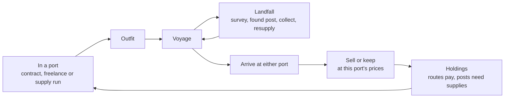

# Cartographer — Chapter 2 Design Doc: The Far Shore

Sep 23, 2026 · Draft

## Overview

In V1 you pay for your ship by charting the first sea. Chapter 2 starts when your charts turn into property: you cross the first sea, find a second port in its far corner, and the world grows to four times its size. From then on you trade between two ports, build trading posts at the sites you found, and put ships to work on routes you charted.

**Design pillars**

- **Charts become holdings.** A kept secret used to pay off only while you sailed it yourself. Now you can build on it: a post, then a route, then a ship that runs the route without you.
- **The world is bigger than the first chart.** Crossing the first sea is the chapter's opening set piece, and it opens three more seas the size of the first.
- **Every port is a market.** Two ports with different prices for cargo and charts make where you end a voyage a decision.

**Chapter 2 scope:** the far side and map expansion, a second port with its own market, contracts that name the port where they end, trading posts, supply runs, a second ship that can be bought and put on a route, and pan/zoom on the chart. There is still no win condition: V1's debt milestone stays, and play goes on without an end.

## The far side

### The far port's corner

Each seed places the far port in either the **north-east** or the **south-east** corner of the first sea. The port sits on a mainland coast that runs along the outer edge of the world, the way home's coast runs along the west edge. Placing it on an edge, not out at sea, keeps it off an island: it's the edge of a second continent, and that continent carries on into the new seas.

- **Guaranteed coast:** world generation reserves that coast, a band of mainland along the north or south edge covering the east part of the first sea, with a sheltered harbour in the corner.
- **No hints:** nothing tells the player which corner holds the port. The rest of the first sea stays procedural, and the reserved coast is plain land until the ship sights it: in V1 play it's just more coast on the edge of the chart. Finding the port is a discovery, not a destination.

### Trigger

The first time the ship sights the far port, the voyage pauses: *"Smoke on the shore, and masts behind a headland. There is a town here, and the coast runs on past the edge of our chart."* The port is marked on the chart and the world grows.

The trip should be hard the first time. Reaching the far corner takes about 40 days in open water, roughly a full hold of stores at V1 capacity. Players get there by buying enlarged stores, stopping to forage, or cutting rations. After the far port is found, the trip becomes one leg of a route.

### The larger map

The world becomes a 2 × 2 grid of squares, each the size of the V1 sea (120 × 84 cells). It grows east, and away from the far port's edge:

- **Far port in the south-east:** the map grows east and north. The first sea becomes the bottom-left square, and the far port sits on the south edge of the world.
- **Far port in the north-east:** the map grows east and south. The first sea becomes the top-left square, and the far port sits on the north edge of the world.

```
Far port south-east               Far port north-east

+-----------+-----------+         +-----------+-----------+
|   North   | North-east|         | First sea |   East    |
|   (new)   |   (new)   |         | home ->  P|   (new)   |
+-----------+-----------+         +-----------+-----------+
| First sea |   East    |         |   South   | South-east|
| home ->  P|   (new)   |         |   (new)   |   (new)   |
+-----------+-----------+         +-----------+-----------+

P = far port, in the corner, on the coast along the world's edge
```

This way the new seas always open away from the port's continent, and the port faces open water on two sides: back west toward home, and out into the new seas.

- **Size:** 240 × 168 cells in total. If the map grows north, everything the player has charted shifts down (y + 84). If it grows south, coordinates don't change.
- **One seed:** all four squares are generated from the seed with noise in world coordinates, so coasts run unbroken across square edges.
- **Sailing limits:** until the far port is found, the ship can't leave the first sea. The other squares exist but are off the edge of the chart.
- **The new squares have their own character:**
  - **The new row** (north or south, whichever way the map grew): north is cold, with furs, timber and drifting ice floes (a new hazard, like reefs but moving a cell or two each season). South is warm, with spice, pearls and more storms.
  - **The east column:** the richest and most remote waters, where the difficulty curve keeps rising. The far port's continent runs along its outer edge.
  - **The diagonal square** (north-east or south-east): the farthest from both ports, and the richest of all.
- **Distance:** remoteness is measured from the nearest port, not only from home. The far port starts a second difficulty gradient of its own.

### The chart gets pan and zoom

At V1 cell size the full world doesn't fit on screen. The chart gains:

- **Zoom:** with the scroll wheel, pinch or +/− buttons, from fit-the-whole-world out to the V1 cell size in.
- **Pan:** by dragging, and it follows the ship at sea unless the player has dragged away.
- **Rose:** a small compass rose in the corner that re-centres the view on the ship.

## The far port

A second port in the far corner of the first sea, with its own name and quay. It belongs to another power, which explains why nobody at home has charted the way there.

- **Same services as home:** harbour master (contracts), chandler (outfit), shipwright, Admiralty office and market.
- **Its own prices:** each port has a price for each cargo, so hauling home or hauling east is a choice:

  | Cargo | Home | Far port |
  | --- | --- | --- |
  | Timber | 0.8× | 1.3× |
  | Furs | 1.2× | 0.9× |
  | Spice | 1.3× | 0.8× |
  | Pearls | 1.0× | 1.1× |

  The numbers are placeholders for tuning. The rule is that each port pays well for what grows far from it.
- **Its own chart buyer:** each Admiralty office pays more for charts of waters near the other port (information it can't get locally), and less for its own.
- **Voyages end at either port.** Wages, contracts and sell-or-keep work the same at both. The ship stays where it docked; the next voyage starts there.
- **Charts are sold once:** a chart sold at either Admiralty becomes public at both ports at once, and neither will buy it again.
- **Seasonal payments:** if any debt is left, the financier has an agent at both ports, and payments are collected at whichever one the ship reaches.

## Contracts

Every contract names two ports: where it's signed and where it ends. The contract card says so plainly: *"Ends at: Kingsquay (return)"* or *"Ends at: Saint Anselm (one way)."*

- **Return contracts** work as in V1.
- **One-way contracts** pay for delivering something across the sea. Arriving at the wrong port doesn't complete the contract: the objective stays open until you reach the named port or the deadline passes.
- **New contract types:**
  - **Despatches:** carry the Admiralty's sealed letters to the other port within N days. Simple, fast, and well paid for speed.
  - **Chart a passage:** chart a route between the two ports that avoids known reefs, as a continuous charted line.
  - **Supply a post:** carry timber, stores and tools to a post the patron owns (the player never builds these).
- **Before the far port is found:** all contracts are return contracts, as in V1.

## Holdings (option 4)

### Trading posts

- **Founding:** a new landfall choice at a surveyed site: *"Found a trading post."* It costs money plus materials carried in the hold (for example £400 and 15 units of timber). Posts can only be built on sites you surveyed.
- **Output:** a post gathers its site's cargo into a warehouse each season, up to a cap. You collect it on a visit; there's no need to strip the site by hand.
- **A forward base:** at a post you can buy stores at a markup and repair the hull. It counts as shelter in storms, and the point-of-no-return estimate treats it as a way home.
- **Upkeep:** neglect is the only threat to a post in chapter 2. Each post needs a supply run every few seasons (timber and stores delivered). Without one, output falls, and after a long neglect the post is abandoned and its buildings are lost.
- **Secrets:** a post is visible. Building on a secret site doubles its chance each season of being found. You trade secrecy for steady output.

### Routes and a second ship

- **Buying ships:** the shipwright sells a larger ship (a brig): a bigger hold, more crew, a stronger hull and more stores. It covers the doc's deferred "ship tiers" with one step up.
- **Putting a ship to work:** you still captain one ship, and it can be either one: take the brig and leave the old ship on a route, or the other way round. The other ship can be laid up in port or put on a route: a charted sequence of ports and posts.
- **Route income:** a ship on a route earns each season, fully automatically: no questions, no micromanagement. Income is based on the cargo moved and the price difference between the ends, less wages and a share for its master.
- **Route risk:** each season there's a chance the route ship takes damage or is lost. The chance rises with known hazards along the route, and falls if the route follows charted coast. Uncharted legs can't be assigned: a route must run over your chart.
- **Seeing it all:** the ledger gains a **Holdings** tab listing posts, routes, ships, their last season's income, and what needs attention.

### Goals without an ending

No win condition. Instead there are milestones that appear in the log and on the Holdings tab:

- Cross to the far side.
- Found your first post.
- Put a ship on a route.
- Chart half of the known world.
- Hold three posts at once.
- A **Crown charter** for a trading company: the natural hook for chapter 3.

## The loop in chapter 2



Between voyages, each season settles the holdings: posts gather cargo and route ships earn or suffer losses. The results are reported when you next reach a port.

## Pacing targets

- The first crossing: 8–12 real minutes, planned for.
- A voyage between the ports once charted: 3–5 minutes.
- **Holdings should add decisions, not chores.** Tending the whole business should take no more than about a minute per voyage; anything more gets automated.
- **Income shift:** by the time a player has two posts and a route, background income should be about equal to what one good voyage earns. The captain's own voyages should still matter.

## Implementation notes

- **World generation:** move to world coordinates and generate all four squares at game start. The seed picks the corner (north-east or south-east) first, so the reserved coast and the growth direction are known from day one. Only the first sea is sailable until the far port is found.
- **Continent coast:** the far port's coast is forced into the generator: a mainland band along the north or south edge from about the first sea's midpoint eastward, continued through the east column. A harbour is cleared in the corner, and a lake-fill check guarantees it connects to home by sea.
- **V1 saves:** regenerate from the seed and re-apply the save's charted cells, names and site state, offset by y + 84 if the map grows north. The first sea's terrain changes where the reserved coast is added. Accept that and tell the player, or start V1 saves on the new map with their chart and money but no old coast.
- **Rendering:** the chart's cached layer grows four-fold (about 1,900 × 1,350 px at V1 cell size). Split it into one cached canvas per square so a reveal only redraws one tile.
- **Performance:** A* runs over 40,000 cells instead of 10,000. That's still fast, but keep recomputing the route home at most once per day, as now.
- **Save size:** grows four-fold, to about 200 KB of JSON. Fine for localStorage, but pack the charted cells as a bitset.

## Open questions

- [x] **Should the player be told which corner?** No. The far port is a secret to be discovered: no rumour, no hint in the log or on the contract board.
- [x] **Is the reserved coast a hint before it's sighted?** No. It's plain land until sighted, like everything else.
- [x] **Do charts sold at one port become public at both?** Yes, at once. A chart can be sold only once.
- [x] **Can the player captain the brig and leave the old ship on a route?** Yes. Either ship can captain or run a route.
- [x] **Do posts ever face anything worse than neglect?** No: neglect only in chapter 2. Storms, rivals and the question of whose land it is wait for later chapters.
- [x] **How much of the route income is automatic?** All of it. Routes earn and take their risks each season with no questions asked; results appear in the port report and on the Holdings tab.

## Deferred

- Rival captains and competing powers bidding for charts (option 2).
- Dead reckoning (option 1).
- Peoples of the new lands (option 3). Posts will need them eventually: founding a post on someone else's coast should be a negotiation, not a purchase.
- Interiors and rivers (option 5).
- More than one step up in ship size.
