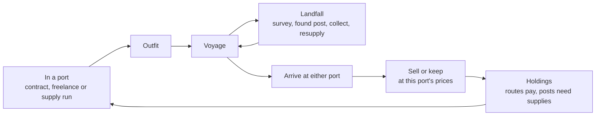

# Cartographer — Chapter 2 Design Doc: The Far Shore

Sep 23, 2026 · Draft

## Overview

In V1 you pay for your ship by charting the first sea. Chapter 2 starts when your charts turn into property: you reach the far side of the first sea, find a second port there, and the world grows to six times its size. From then on you trade between two ports, build trading posts at the sites you found, and put ships to work on routes you charted.

**Design pillars**

- **Charts become holdings.** A kept secret used to pay off only while you sailed it yourself. Now you can build on it: a post, then a route, then a ship that runs the route without you.
- **The world is bigger than the first chart.** Crossing the first sea is the chapter's opening set piece, and it opens a sea five times larger.
- **Every port is a market.** Two ports with different prices for cargo and charts make where you end a voyage a decision.

**Chapter 2 scope:** the far side and map expansion, a second port with its own market, contracts that name the port where they end, trading posts, supply runs, a second ship that can be bought and put on a route, and pan/zoom on the chart. There is still no win condition: V1's debt milestone stays, and play goes on without an end.

## The far side

### Trigger

The first time the ship comes within sight of the east edge of the first sea, the voyage pauses: *"The water changes colour and the swell runs long from the east. There is more sea beyond the chart."* The chart grows and the far port comes into view on the coast ahead.

The trip should be hard the first time. Crossing the first sea takes about 40 days in open water, which is roughly a full hold of stores at V1 capacity. Players get there by buying enlarged stores, stopping to forage, or cutting rations. After the far port is found, the trip becomes one leg of a route.

### The larger map

The world becomes a 2 × 3 grid of squares, each the size of the V1 sea (120 × 84 cells). The first sea is the middle square of the west column. Home stays on the west edge, so the map grows north, south and east, not west.

```
+-------------+-------------+
|  North-west |  North-east |   new
+-------------+-------------+
|  First sea  |  East sea   |   first sea: V1 map, unchanged
|  (home) ->  |             |   east sea: new
+-------------+-------------+
|  South-west |  South-east |   new
+-------------+-------------+
```

- **Size:** 240 × 252 cells in total. Everything the player has charted keeps its position; only the coordinates shift (y + 84).
- **One seed:** the whole 2 × 3 world is generated from the seed with noise in world coordinates, so coasts run unbroken across square edges. The first sea is the same map a V1 player already knows.
- **Sailing limits:** until the far side is reached, the ship can't leave the first sea. The other squares exist but are off the edge of the chart.
- **The new squares have their own character:**
  - **North:** colder, rich in furs and timber, with ice floes (a new hazard: like reefs, but they drift a cell or two each season).
  - **South:** warm, rich in spice and pearls, with more storms.
  - **East:** the richest and most remote, where the difficulty curve keeps rising.
- **Distance:** remoteness is measured from the nearest port, not only from home. The far port starts a second difficulty gradient of its own.

### The chart gets pan and zoom

At V1 cell size the full world doesn't fit on screen. The chart gains:

- **Zoom:** with the scroll wheel, pinch or +/− buttons, from fit-the-whole-world out to the V1 cell size in.
- **Pan:** by dragging, and it follows the ship at sea unless the player has dragged away.
- **Rose:** a small compass rose in the corner that re-centres the view on the ship.

## The far port

A second port on the far side of the first sea, with its own name and quay.

- **Same services as home:** harbour master (contracts), chandler (outfit), shipwright, Admiralty office and market.
- **Its own prices:** each port has a price for each cargo, so hauling home or hauling east is a choice:

  | Cargo | Home | Far port |
  | --- | --- | --- |
  | Timber | 0.8× | 1.3× |
  | Furs | 1.2× | 0.9× |
  | Spice | 1.3× | 0.8× |
  | Pearls | 1.0× | 1.1× |

  The numbers are placeholders for tuning. The rule is that each port pays well for what grows far from it.
- **Its own chart buyer:** each Admiralty office pays more for charts of waters near the other port (information it can't get locally), and less for its own.
- **Voyages end at either port.** Wages, contracts and sell-or-keep work the same at both. The ship stays where it docked; the next voyage starts there.
- **Seasonal payments:** if any debt is left, the financier has an agent at both ports, and payments are collected at whichever one the ship reaches.

## Contracts

Every contract names two ports: where it's signed and where it ends. The contract card says so plainly: *"Ends at: Kingsquay (return)"* or *"Ends at: Saint Anselm (one way)."*

- **Return contracts** work as in V1.
- **One-way contracts** pay for delivering something across the sea. Arriving at the wrong port doesn't complete the contract: the objective stays open until you reach the named port or the deadline passes.
- **New contract types:**
  - **Despatches:** carry the Admiralty's sealed letters to the other port within N days. Simple, fast, and well paid for speed.
  - **Chart a passage:** chart a route between the two ports that avoids known reefs, as a continuous charted line.
  - **Supply a post:** carry timber, stores and tools to a post the patron owns (the player never builds these).
- **Before the far port is found:** all contracts are return contracts, as in V1.

## Holdings (option 4)

### Trading posts

- **Founding:** a new landfall choice at a surveyed site: *"Found a trading post."* It costs money plus materials carried in the hold (for example £400 and 15 units of timber). Posts can only be built on sites you surveyed.
- **Output:** a post gathers its site's cargo into a warehouse each season, up to a cap. You collect it on a visit; there's no need to strip the site by hand.
- **A forward base:** at a post you can buy stores at a markup and repair the hull. It counts as shelter in storms, and the point-of-no-return estimate treats it as a way home.
- **Upkeep:** each post needs a supply run every few seasons (timber and stores delivered). Without one, output falls, and after a long neglect the post is abandoned and its buildings are lost.
- **Secrets:** a post is visible. Building on a secret site doubles its chance each season of being found. You trade secrecy for steady output.

### Routes and a second ship

- **Buying ships:** the shipwright sells a larger ship (a brig): a bigger hold, more crew, a stronger hull and more stores. It covers the doc's deferred "ship tiers" with one step up.
- **Putting a ship to work:** you still captain one ship. The other can be laid up in port or put on a route: a charted sequence of ports and posts.
- **Route income:** a ship on a route earns each season, in the background. Income is based on the cargo moved and the price difference between the ends, less wages and a share for its master.
- **Route risk:** each season there's a chance the route ship takes damage or is lost. The chance rises with known hazards along the route, and falls if the route follows charted coast. Uncharted legs can't be assigned: a route must run over your chart.
- **Seeing it all:** the ledger gains a **Holdings** tab listing posts, routes, ships, their last season's income, and what needs attention.

### Goals without an ending

No win condition. Instead there are milestones that appear in the log and on the Holdings tab:

- Cross to the far side.
- Found your first post.
- Put a ship on a route.
- Chart half of the known world.
- Hold three posts at once.
- A **Crown charter** for a trading company: the natural hook for chapter 3.

## The loop in chapter 2



Between voyages, each season settles the holdings: posts gather cargo and route ships earn or suffer losses. The results are reported when you next reach a port.

## Pacing targets

- The first crossing: 8–12 real minutes, planned for.
- A voyage between the ports once charted: 3–5 minutes.
- **Holdings should add decisions, not chores.** Tending the whole business should take no more than about a minute per voyage; anything more gets automated.
- **Income shift:** by the time a player has two posts and a route, background income should be about equal to what one good voyage earns. The captain's own voyages should still matter.

## Implementation notes

- **World generation:** move to world coordinates and generate all six squares at game start. Only the first sea is sailable until the far side is reached. V1 saves need a migration: regenerate from the seed, then re-apply the save's charted cells, names and site state at the y + 84 offset. The first sea's terrain will change slightly if the generator changes; accept that and warn the player, or keep the V1 generator for the first sea and blend at the seams.
- **Rendering:** the chart's cached layer grows six-fold (about 1,900 × 2,000 px at V1 cell size). Split it into one cached canvas per square so a reveal only redraws one tile.
- **Performance:** A* runs over 60,000 cells instead of 10,000. That's still fast, but cache the route home and recompute it at most once per day, as now.
- **Save size:** grows six-fold, to about 300 KB of JSON. Fine for localStorage, but pack the charted cells as a bitset.

## Open questions

- [ ] **Where does the far port sit?** Default above: on the east edge of the first sea, where you arrive, so it's the gateway to the new squares. The alternative is the far east of the new map, which makes finding it a second, longer expedition.
- [ ] **Is the 2 × 3 reading right?** This doc reads "one square in each direction" as north, south and east of the first sea: two columns and three rows, with nothing west of home.
- [ ] **Do charts sold at one port become public at both?** Simplest: yes. More interesting: news travels slowly, so a chart sold east reaches home a season later, and you can sell the same coast to both Admiralties if you're quick.
- [ ] **Can the player captain the brig and leave the old ship on a route,** or is the route ship always the smaller one?
- [ ] **Do posts ever face anything worse than neglect?** Storms, rivals, or (with chapter 3's peoples) the question of whose land it is. Recommended: neglect only in chapter 2.
- [ ] **How much of the route income is automatic?** Fully automatic is simplest. A light version asks one question per route per season ("Carry furs or timber?").

## Deferred

- Rival captains and competing powers bidding for charts (option 2).
- Dead reckoning (option 1).
- Peoples of the new lands (option 3). Posts will need them eventually: founding a post on someone else's coast should be a negotiation, not a purchase.
- Interiors and rivers (option 5).
- More than one step up in ship size.
