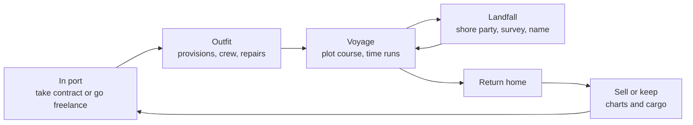

# Cartographer — V1 Design Doc

Sep 22, 2026 · @Someone

## Overview

Cartographer is an Age-of-Exploration voyage game: you captain one ship into an uncharted, fog-covered sea, chart what you find, and decide whether to sell your charts or keep them secret. V1 proves that this small loop is fun on its own: set sail, discover land, return, sell or keep.

**Design pillars**

- **The map is your progress.** Everything you learn shows up on the chart, and the chart is what you sell.
- **Push your luck.** Provisions are the clock; every day past halfway is a bet.
- **Knowledge is currency.** Selling a discovery pays now; keeping it pays over time, until someone else finds it.

**V1 scope:** one ship, one home port, one procedurally generated sea, an accurate chart (no navigation error), contracts and freelance voyages, resource sites, sell-or-keep, provisions and hull, a small set of events, and a starting debt as the goal.

## Core loop

Each voyage runs port to port in six steps; a full cycle should take 5–10 real minutes.

Voyage and landfall repeat until the player turns for home, or provisions or the hull force the decision.

## Economy

Contracts are safe money with strings attached; freelance voyages carry all the risk and keep all the reward. Early play leans on contracts until the player can afford to fund their own voyages.

### Voyage types

| Type | Who pays for the voyage | Who owns the chart | Pay |
| --- | --- | --- | --- |
| Contract (Crown / Admiralty) | Patron's advance covers much of it | Patron | Advance + completion bonus |
| Freelance | Player | Player | Whatever the player finds and sells |

Contract objectives are concrete: "chart the coast south of Cape X" or "find a harbor within 20 days' sail." Charts from a contract cannot be kept secret.

### Income

- **Chart sales.** Sold to the Admiralty at a fixed, public rate based on area charted. Selling makes the discovery known to everyone.
- **Cargo.** Resource sites (timber, furs, spice, pearls) yield cargo the player hauls home and sells.
- **Secret routes.** A site's cargo price falls with the number of ships that know it. Keeping a chart secret lets the player run that route alone at full price.
- **Treasure.** Rare wrecks or ruins found as events. Kept rare so it doesn't turn the game into a lottery.

### The secret bet

Each kept secret has a small chance per season of being discovered by someone else. Once discovered, its value drops as if the player had sold it, but the player got no lump sum. This keeps hoarding from being free.

### Expenses

- **Provisions:** food and water per crew member per day; the voyage timer.
- **Crew wages:** advance at signing, remainder on return.
- **Repairs:** patched at sea with supplies, fixed properly in port.
- **Instruments:** permanent upgrades. In V1 these extend sight radius (see Open questions).
- **Port fees:** a small flat cost to outfit.

### Goal: the debt

The player starts owing money on the ship to a financier, with regular payments due. Paying it off is the V1 win condition; failing to make payments is a loss.

## The voyage

The player plots a course, time runs day by day, and the game stops for decisions. No hands-on steering, no pure autopilot.

### How time works

- The player sets a heading or drops waypoints on the chart.
- Days tick forward automatically; the player can pause and change course at any time.
- The game auto-pauses on interrupts: land sighted, sign of land, storm building, provisions at a threshold (e.g. halfway, 25%), contract objective reached.
- Fog clears within the ship's sight radius as it sails.

### Decisions at sea

- **Where to probe.** Signs of land appear at the edge of vision (seabirds, driftwood, floating vegetation, clouds over land) and point toward undiscovered coasts.
- **When to turn back.** The return trip costs as much as the trip out. The chart shows a "point of no return" estimate for current provisions.
- **Coast or cross.** Following a known coast is slower and safer; open water is faster, reveals more, and may find nothing.
- **Weather.** Run before a storm (lose course), ride it out (hull damage), or make for known shelter.
- **Rationing.** Cut rations to stretch range; raises the chance of sickness events.

## Landfall

Sighting land pauses the voyage and opens a landfall screen with four choices:

- **Send a shore party.** Refill water and food, which extends the voyage. Small risk of injury, sickness or losing crew.
- **Survey the site.** Reveals whether the site has a resource and how much cargo it can yield. Loads cargo if there is hold space.
- **Name it.** The player names each discovered coast, cape, bay or island. Names appear on the chart and in the sell-or-keep screen.
- **Leave.** Continue the voyage or turn for home.

Each landfall should take under a minute and involve one or two real choices.

## World and map

V1 uses a single procedurally generated sea on a grid, with an accurate chart: what the player sees is exactly where things are.

- **Home port** sits at one edge; the unknown opens outward from it.
- **Fog of war** covers everything not yet seen. Charted areas stay revealed permanently.
- **Landmasses** range from small islands to long coastlines, placed so difficulty rises with distance from home.
- **Resource sites** are placed on coasts, each with a resource type and a yield. Richer sites sit farther out.
- **Hazards** such as reefs and shoals are visible only once charted.
- **Seeded generation** so a map can be replayed or shared.

## Events, progression and pacing

### Events (V1 set)

- **Storm:** choose to run, ride it out, or seek shelter.
- **Sickness:** crew lost or slowed; more likely under short rations.
- **Becalmed:** days pass with no progress, draining provisions.
- **Wreck sighted:** chance of salvage or treasure, at some risk.
- **Spoiled stores:** lose part of the provisions.

### Progression

- Money buys instrument upgrades and larger provision and cargo capacity within the single V1 ship.
- Reputation from completed contracts unlocks better-paying contracts farther out.
- The known map itself is progression: each voyage starts from a larger charted area.

### Win and lose

- **Win:** pay off the ship's debt.
- **Lose:** miss a debt payment, or lose the ship at sea.

### Pacing targets

- A voyage takes 3–8 real minutes with 4–8 meaningful stops.
- No stretch longer than about 20 seconds without a choice; speed up time or add a sign or event there.
- A full V1 run (start to debt paid) takes roughly 1–2 hours.

## Open questions

- [ ] With an accurate map, what do instrument upgrades do in V1? Candidates: larger sight radius, earlier warning of storms, better survey results.
- [ ] Does the Admiralty pay by area charted, by features found (harbors, capes, resource sites), or both?
- [ ] How is a kept secret's discovery chance tuned? Flat per season, or higher for richer sites and sites closer to home?
- [ ] Debt terms: one lump sum by a deadline, or regular payments?
- [ ] Is time strictly day-by-day ticks, or continuous movement with day markers?
- [ ] Visual style of the chart: period parchment, or a cleaner modern map?

## Notes: deferred to later versions

### Navigation accuracy (dead reckoning)

- Two layers: the true sea (hidden) and the player's chart. The ship tracks a true and a believed position; currents and wind push the true position off each day.
- Coasts are charted relative to the believed position, so position error is inked into the chart. Each segment stores its confidence.
- Error runs east–west only: noon sights give latitude, not longitude. Overcast days can add a little north–south error. Players rediscover "latitude sailing."
- UI shows an uncertainty ellipse around the ship and draws low-confidence coast as sketchy or dotted, never revealing where the chart is wrong.
- Fixes come from home port (the only absolute anchor) or trusted landmarks; a badly charted landmark gives a bad fix. Revisiting a coast with a good fix lets the player redraw it.
- Chart price scales with confidence. Instruments slow error growth; the marine chronometer (1760s) is the endgame upgrade that nearly eliminates drift.
- Keep errors modest (about 1–3 cells) and teach it on an early contract that revisits a charted cape.

### Ships, crew and people

- Ship tiers that unlock longer, larger expeditions.
- Crew as individuals: navigator, surgeon and other specialists; morale and mutiny.
- Native peoples as factions with their own interests and leverage: trade, diplomacy, conflict.

### Competition and markets

- Actual rival ships racing to discoveries, replacing the abstract discovery chance.
- Multiple ports and powers bidding against each other for charts.
- Selling charts to merchant houses for exclusive routes, not just the Admiralty.
- Investors who fund a voyage for a share of the profits.
- Withholding discoveries from a contract chart, with a reputation risk if caught.

### Expanding expeditions

- Later contract types: trade routes, colony supply runs, escort work.
- Colonies and supply routes as ongoing operations.
- Plotlines anchored to procedurally placed locations.
- As coastlines fill in, the "unknown" shifts to interiors, politics and rival powers.

### Smaller ideas

- More event types and chained events.
- Common treasure and salvage beyond V1's rare wrecks.
